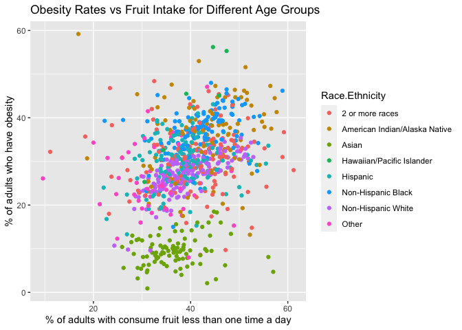

```{r setup, include=FALSE}
knitr::opts_chunk$set(echo = TRUE,
                      tidy.opts = list(width.cutoff = 80), tidy = TRUE,
                      fig.path = "figures/",
                      cache = FALSE)
```


# Abstract
The prevalence of obesity has increased in the United States in the past $decades^1$. A wide range of medical complications of obesity, such as diabetes, hypertension, heart disease, respiratory disease, significantly reduced patients’ quality of $life^2$. This statistical analysis provides time trends for adults over 18 years old are classified to have obesity (body mass index (BMI) > 30) from 2011-2016, using data from Center for Disease Control and Prevention (CDC). Moreover, the data is inspected with respect to the food intake and physical activity levels.

# Introduction
Over the last three decades, mean body mass index (BMI; kg/m2) has increased by 0.4 kg/m2 per $decade^3$. The United States has the highest mean BMI among high-income countries, leading to one in four adults having a BMI > 30 kg/m2 based on self-reported height and $weight^4$. This study analyses data from the Center for Disease Control and Prevention (CDC) collected over 6 years from 2011-2016 in all states of America. Each data point represents a proportion of people that fall under a particular demographic. Individuals are classified into age, income, gender, education and ethnic categories. Aside from obesity rates, the data also includes proportions of people with specific food intake habits, as well as various physical activity levels. Our goal is to determine the existence of a relationship between obesity rates and lifestyle choices of patients. We will be inspecting how obesity rates may relate to percent of people that consume fruits and vegetables less than one time per day and do not engage in leisure time physical activity. Additional analysis will be performed to confirm the increasing levels of obesity in the United States and precisely identify a state with significant evidence. 

# Data Description
Center for Disease Control (CDC) collected data from distinct demographic groups throughout 2011 to 2016 in all states of America. Demographic groups include: age, income, education level, ethnicity and gender. Each group was sampled for 9 different categories: 

* Percent of adults aged 18 years and older who have obesity
* Percent of adults aged 18 years and older who have an overweight classification
* Percent of adults who report consuming fruit less than one time daily
* Percent of adults who report consuming vegetables less than one time daily
* Percent of adults who engage in muscle-strengthening activities on 2 or more days a week
* Percent of adults who achieve at least 150 minutes a week of moderate-intensity aerobic physical activity or 75 minutes a week of vigorous-intensity aerobic activity (or an equivalent combination)
* Percent of adults who achieve at least 150 minutes a week of moderate-intensity aerobic physical activity or 75 minutes a week of vigorous-intensity aerobic physical activity and engage in muscle-strengthening activities on 2 or more days a week
* Percent of adults who achieve at least 300 minutes a week of moderate-intensity aerobic physical activity or 150 minutes a week of vigorous-intensity aerobic activity (or an equivalent combination)
* Percent of adults who engage in no leisure-time physical activity

In this study we would like to answer the following questions:

1. Is there relationship between *obesity rates* and *fruit/vegetable intake alongside physical activity*?
2. Is there significant evidence that *obesity rates* in the USA are growing? If so, for which states? 

To get a sense of what to anticipate for the upcoming analysis, we will plot classifications of interest versus obesity rates. Age category is crucial to investigate, therefore we will start by plotting this obesity rates versus physical activity for each age demographic.

</img>

Figure 1

There's a fairly evident pattern seen form the plot, however needs further analysis on the strength.

Now plotting the same graph but for different ethnic demographic.

</img>

Figure 2

This plot does not give us much insight on a relationship between obesity levels and physical activity, however after conducting analysis we may deduce some type of pattern. 

Moving on to another to investigate connection between obesity % and fruit intake again, classified by age. 

</img>

Figure 3


An apparent linear pattern is present between all age groups. Further analysis necessary to determine the strength. 

Plotting the same graph but for different ethnic demographic. 

</img>

Figure 4

Once again, racial classification does not seem to give us any type of insight. 

To help us further visualize mandatory data, a 3D plot of obesity percentages, fruit consumption and physical activity levels were plotted.

</img>

Figure 5

- - - - 

To answer the second question, visualization of obesity rates per year is the most appropriate way to understand what data we are dealing with. 

</img>

Figure 6

It is not evident which states are showing a positive relationship and whether or not it is strong. 

# Methods

This analysis was completed using statistical software RStudio. Package "tidyverse" was used for visualization and dataframe manipulation. Package "faraway" provided function for calculation of variance inflation factor, which was used to assess multicollinearity. Robust regression model was built using "MASS" package. 3D plot was created using "plot3D" package, rendered with "rgl" and converted into gif format with "magick" package. An ordinary least squares regression model, analysis of variance and other basic function were performed with pre-loaded default packages like "base" and "stats". Documentation of the analysis was written in R environment using Markdown language.

# Results

Firstly we need to analyze the original dataset, remove all the unnecessary variables and observations, add a new point to the dataset to make it unique. Since we are mainly going to be working with the obesity percentage data points, we will fill in the missing value for obesity % in Alabama in 2011, specifically for "Other" ethnicity. Particular value was chosen by looking at near by states at that year for that demographic. 
```{r message = FALSE}
library(tidyverse)
library(faraway)
cdc = read.csv("Nutrition__Physical_Activity__and_Obesity_-_Behavioral_Risk_Factor_Surveillance_System.csv")

# Removing LocationAbbr, and renaming LocationDesc, DataSource, Topic, TopicID, ClassID, GeoLocation, Data_Value_Unit, Data_Value_Type, DataValueTypeID, Data_Value_Footnote_Symbol, StratificationCategoryId1, StratificationID1
cdc_adjusted = cdc %>% select(-YearEnd, -LocationAbbr, -Datasource, -Topic, -TopicID, -ClassID, -GeoLocation, -Data_Value_Unit, -Data_Value_Type, - DataValueTypeID, -Data_Value_Footnote_Symbol, -StratificationCategoryId1, -StratificationID1, -Data_Value_Alt, -Data_Value_Footnote, -Low_Confidence_Limit, -High_Confidence_Limit) %>% rename(Year = YearStart, Location = LocationDesc)

#Removing Virigin Islands because they have observations for only 2016
cdc_adjusted = cdc_adjusted[!(cdc_adjusted$Location == "Virgin Islands"),]
cdc_adjusted[28,5] = 30.2
cdc_adjusted[28,6] = 64
```


```{r echo = FALSE}
#Percent of adults who report consuming fruit less than one time daily
Q18 <- cdc_adjusted %>% filter(QuestionID == 'Q018' )%>%select(-QuestionID) %>%
  rename(Class18=Class,Question18=Question, Data_Value18=Data_Value, Sample_Size18=Sample_Size)

#Percent of adults who report consuming vegetables less than one time daily
Q19 <- cdc_adjusted %>% filter(QuestionID == 'Q019' )%>%select(-QuestionID) %>%
  rename(Class19=Class,Question19=Question, Data_Value19=Data_Value, Sample_Size19=Sample_Size)

#Percent of adults aged 18 years and older who have obesity
Q36 <- cdc_adjusted %>% filter(QuestionID == 'Q036' )%>%select(-QuestionID) %>%
  rename(Class36=Class,Question36=Question, Data_Value36=Data_Value, Sample_Size36=Sample_Size)

#Percent of adults aged 18 years and older who have an overweight classification
Q37 <- cdc_adjusted %>% filter(QuestionID == 'Q037' )%>%select(-QuestionID)

#Percent of adults who achieve at least 150 minutes a week of moderate-intensity aerobic physical activity or 75 minutes a week of vigorous-intensity aerobic activity (or an equivalent combination)
Q43 <- cdc_adjusted %>% filter(QuestionID == 'Q043' )%>%select(-QuestionID)

#Percent of adults who achieve at least 150 minutes a week of moderate-intensity aerobic physical activity or 75 minutes a week of vigorous-intensity aerobic physical activity and engage in muscle-strengthening activities on 2 or more days a week
Q44 <- cdc_adjusted %>% filter(QuestionID == 'Q044' )%>%select(-QuestionID)

#Percent of adults who achieve at least 300 minutes a week of moderate-intensity aerobic physical activity or 150 minutes a week of vigorous-intensity aerobic activity (or an equivalent combination)
Q45 <- cdc_adjusted %>% filter(QuestionID == 'Q045' )%>%select(-QuestionID)

#Percent of adults who engage in muscle-strengthening activities on 2 or more days a week
Q46 <- cdc_adjusted %>% filter(QuestionID == 'Q046' )%>%select(-QuestionID)

#Percent of adults who engage in no leisure-time physical activity
Q47 <- cdc_adjusted %>% filter(QuestionID == 'Q047' )%>%select(-QuestionID) %>%
  rename(Class47=Class,Question47=Question, Data_Value47=Data_Value, Sample_Size47=Sample_Size)


total <- inner_join(Q18,Q19,by=c("Year","Location","Total", "Age.years.", "Education", "Gender", "Income", "Race.Ethnicity","LocationID","StratificationCategory1","Stratification1"))
total <-inner_join(total,Q36,by=c("Year","Location","Total", "Age.years.", "Education", "Gender", "Income", "Race.Ethnicity","LocationID","StratificationCategory1","Stratification1"))
total <-inner_join(total,Q47,by=c("Year","Location","Total", "Age.years.", "Education", "Gender", "Income", "Race.Ethnicity","LocationID","StratificationCategory1","Stratification1"))
total <- total%>% select(-Class18,-Class19,-Class36,-Class47, -Question18,-Question19,-Question36,-Question47)%>%drop_na()%>%rename(Age=Age.years.)
```
Other tedious dataframe transformations were omitted from the report and further information is available in the appendix.

We now want to analyze the ordinary least squares model that relates obesity rates to people who report eating fruit and vegetable less than 1 time a day and engage in no physical activity. $obesity =\beta_0 + \beta_1fruit + \beta_2vegetable + \beta_3exercise$
```{r OriginalModel}
model <- lm(Data_Value36 ~ Data_Value18 + Data_Value19 + Data_Value47, data=total)
summary(model)
```
Individual p-values are showing significant evidence towards being important except for percent of people who consume vegetables less than once daily (Data_Value19). Backwards elimination technique is applicable in this case to reduce the model and hopefully increase the R-squared.

```{r OriginalModelBack}
#Using Backward Elimination method, remove the variable Data_Value19
model <- lm(Data_Value36 ~ Data_Value18 + Data_Value47, data=total)
summary(model)
```
All variables still remain significant in the model and R-squared is a bit higher as well. Updated linear regression model now becomes: $$obesity =\beta_0 + \beta_1fruit + \beta_2vegetable$$. Following, variance inflation factor is calculated to ensure multicollinearity is not present in the equation.

```{r ModelColl}
vif(model)
```
Since both values are notably below 10, we can safely say that multicollinearity is not an issue.

Crucial part of model validation is residual assessment. Residuals for particular model are:

```{r OginalModelRes, fig.show = "hold", out.width = "50%", echo = FALSE}
par(mar = c(4, 4, 0.1, 0.1))
plot(model, which = c(1,2))
plot(model, which = c(3,4))
```

As seen from the plots above, residuals are uncorrelated and the constant variance assumption is satisfied, although residuals do tend to deviate from the straight line in the Normal Q-Q plot. Since there is no apparent pattern in the residuals, data transformation is not relevant. Fitting a robust linear regression model is a more applicable solution in this case with Huber's t robust criterion function. 

```{r message = FALSE}
library(MASS)
model_robust = rlm(Data_Value36 ~ Data_Value18 + Data_Value47, data=total)
summary(model_robust)$coefficient
```
The resulting coefficient values are highly similar to those in the ordinary least squares regression model. Therefore, we will continue our analysis with the OLS equation.

```{r message= FALSE, echo = FALSE}
detach("package:MASS")
```

Cross validation was carried out to further assess the performance of the model. Even though the R-squared value of the current model is 0.2975, mean prediction error turned out to be 20.86% for the percent of adults who have obesity. 
```{r echo = FALSE, eval = FALSE}
set.seed(123)

nsamp = ceiling(0.75*nrow(total)) # number of samples                             
training_samps = sample(c(1:nrow(total)),nsamp)   # sampled cases

train_data <- total[training_samps, ]   
test_data  <- total[-training_samps, ]

cross_val_model<- lm(Data_Value36 ~ Data_Value18 + Data_Value19, data=train_data)
summary(cross_val_model)

preds <- predict(cross_val_model,test_data)
error_percent<-100*abs(preds-test_data$Data_Value36)/test_data$Data_Value36
mean(error_percent) # prediction error is around 20%
```
Further altering current regression model $obesity =\beta_0 + \beta_1fruit + \beta_2exercise$ to be sensetive to a particular demographic, such as age, ethnicity, gender, income or education. The equation now becomes: $ obesity =\beta_0 + \beta_1fruit + \beta_2exercise + \beta_iIndicator_i$

Results of the first instance where the indicator variable is Age:

```{r echo = FALSE}
model_age <- lm(Data_Value36 ~ Data_Value18 + Data_Value47 + Age, data=total)
summary(model_age)
```
Summary of this model shows every age group to be significant. Relating back to Figure 1 in the data description section, particular model solidifies our findings. 

Applying the same concept but now indicator variable will be ethnicity.

```{r echo = FALSE}
model_race <- lm(Data_Value36 ~ Data_Value18 + Data_Value47 + Race.Ethnicity, data=total)
temp = as.data.frame(summary(model_race)$coef[,4])
colnames(temp) = c("Pr(>|t|)")
temp
```
Even though the related Figure 2, does not suggest strong visual evidence that different racial demographics have strong linear correlation, the hypothesis test indicates otherwise for most variables. Most likely that is due to addition of the fruit consumption variable in the model, where the graph does not include it. 

Repeating the same procedure for other demographics to find that gender, income and education do not have strong evidence of a relationship between other variables. 


```{r ggplotObsPhysAge, echo = FALSE, eval = FALSE}
ggplot(total, aes(x = Data_Value47, y = Data_Value36, colour = Age)) + geom_point(data = subset(total, Age != "")) + 
  ggtitle ("Obesity Rates vs. Physical Activity for Different Age Groups") + xlab("% of adults with no physical activity") + 
  ylab("% of adults who have obesity ")
```

```{r ggplotObsFruitAge, echo = FALSE, eval = FALSE}
ggplot(total, aes(x = Data_Value18, y = Data_Value36, colour = Age)) + geom_point(data = subset(total, Age != "")) + 
  ggtitle("Obesity Rates vs Fruit Intake for Different Age Groups") + xlab("% of adults with consume fruit less than one time a day") + ylab("% of adults who have obesity")
```

```{r echo = FALSE, eval = FALSE}
model_gender <- lm(Data_Value36 ~ Data_Value18 + Data_Value47 + Gender, data=total)
summary(model_gender) 

model_income <- lm(Data_Value36 ~ Data_Value18 + Data_Value47 + Income, data=total)
summary(model_income)

model_education <- lm(Data_Value36 ~ Data_Value18 + Data_Value47 + Education, data=total)
summary(model_education)

model_race <- lm(Data_Value36 ~ Data_Value18 + Data_Value47 + Race.Ethnicity, data=total)
summary(model_race)
```

```{r ggplotObsPhysRace, echo = FALSE, eval = FALSE}
ggplot(total, aes(x = Data_Value47, y = Data_Value36, colour = Race.Ethnicity)) + geom_point(data = subset(total, Race.Ethnicity != "")) + 
  ggtitle("Obesity Rates vs. Physical Activity for Different Ethnicities") + xlab("% of adults with no physical activity") + 
  ylab("% of adults who have obesity ")
```
```{r ggplotObsFruitRace, echo = FALSE, eval = FALSE}
ggplot(total, aes(x = Data_Value18, y = Data_Value36, colour = Race.Ethnicity)) + geom_point(data = subset(total, Race.Ethnicity != "")) + 
  ggtitle("Obesity Rates vs Fruit Intake for Different Age Groups") + xlab("% of adults with consume fruit less than one time a day") + ylab("% of adults who have obesity")
```


## Analysis of total obesity rates for every state
Analyzing the ordinary least squares model of how obesity rates relate to the year in order to conclude growing obesity rate in the country. Specifically, we will look at the "Total" category which represents the final obesity percentage for each state in a particular year.

$$ obesity =\beta_0 + \beta_1year + \epsilon$$
```{r echo = FALSE}
Q36 = Q36 %>% dplyr::select(Year, Location, Class36, Question36, Data_Value36, Sample_Size36, Total) %>% arrange(Location)
Q36[Q36 == ""] = NA
Q36 = Q36 %>% drop_na()
model_all_states = lm(Data_Value36 ~ Year, data = Q36)
summary(model_all_states)
```

P-value for the model does seem to indicated that there's evidence of significant relationship between obesity rates and year, however the R-squared is extremely low. Let's take a look at the residuals.

```{r ggplotObsYear, fig.width = 10, echo = FALSE, eval = FALSE}
ggplot(Q36, aes(x = Year, y = Data_Value36, colour = Location)) + geom_line() +
  ggtitle("2011-2016 Obesity Rates By State") + xlab("Year") + ylab("% of adults who have obesity")
```

```{r fig.show = "hold", out.width = "50%", ModelObsYearRes}
par(mar = c(4, 4, 0.1, 0.1))
plot(model_all_states, which = c(2,2))
plot(model_all_states, which = c(4,4))
```
Standardized residuals do not look out of place for the most part. There are a couple of observations that fall out of the straight normality line like #307 and #35, however that is expected. Out of 319 observations, 1% of those are expected to be potential outliers according Normal Distribution. Taking a look at the Cook's distance to inspect any influential points, we find that gladly there aren't any. Observation #307 appears again with the largest Cook's distance of just about 0.025. In order for the point to be considered influential, it's Cook's distance should be greater than 1. 

Let's reduce our set of observations to only the states that show significant evidence of increase obesity rates. Visualizing will also help us draw any conclusions. 


```{r ggplotYearFinal, message = FALSE, echo = FALSE}
#ggplot(Q36, aes(x = Year, y = Data_Value36, colour = Location)) + geom_line()

reg_coef_all_states = Q36 %>% group_by(Location) %>%
  summarize(slope = lm(Data_Value36 ~ Year)$coef["Year"],
            pvalue = coef(summary(lm(Data_Value36 ~ Year)))[2,4]) 

Q36_reduced = reg_coef_all_states %>% filter(pvalue<0.05) %>% left_join(Q36)

ggplot(Q36, aes(x = Year, y = Data_Value36)) + geom_line(aes(group = Location), colour = "grey", alpha = 0.4) +
  geom_smooth(Q36_reduced, mapping = aes(x = Year, y = Data_Value36), colour = "red") +
  geom_line(Q36_reduced, mapping = aes(x = Year, y = Data_Value36, colour = Location), alpha = 0.35) + 
  geom_smooth(colour = "black") +
  ggtitle("2011-2016 National Obesity Rates") + xlab("Year") + ylab("Obesity %")
```
Particular image represents total obesity rates graph of observations for all states. Lines in grey colour are the states that do not show significant increase in obesity rates in 6 years. That was deducted by building an individual linear model for each state versus year. If the p-value was greater than 0.05, that state is considered to not have increasing obesity rates. In contrary, coloured lines indicate growing obesity rates. Further more, red and black lines show the full model slope for both, all states and states with growing obesity rates respectively. 

We can investigate this further by looking more closely at the observations. States that have relatively low obesity rates in 2011, tend to maintain that trend and hold obesity rates constant. On the other hand, states with higher obesity rates initially, show evidence of increasing rates.

```{r}
model_updated = lm(Data_Value36 ~ Year, data = Q36_reduced)
summary(model_updated)
```


```{r fig.show = "hold", out.width = "50%"}
par(mar = c(4, 4, 0.1, 0.1))
plot(model_updated, which = c(2,2))
plot(model_updated, which = c(4,4))
```
Taking a look at the updated model for obesity rates over the years, there's a substantial increase in the value of intercept coefficient and slope remains relatively the same. Residuals appear to be in good shape with slight deviation from the Normal line and do not violate the independence assumption. 


3D plot
```{r eval = FALSE, echo = FALSE}
# Test if the points form a plane in a 3D space.
library(plot3D)
library(rgl)
scatter3D(total$Data_Value18, total$Data_Value47, total$Data_Value36, 
          theta = 45, phi = 0, xlab='Fruit', ylab='Physical Activity', zlab='Obesity')
rgb.palette <- colorRampPalette(c("green", "red","black"), space = "rgb")
par3d(windowRect = c(20,30,600,600))
plot3d(total$Data_Value18, total$Data_Value47, total$Data_Value36, xlab='Fruit', ylab='Physical Activity', zlab='Obesity',
       theta = 45, phi = 0, col = rgb.palette(100)[as.numeric(cut(total$Data_Value36, breaks = 50))])
play3d(spin3d(axis = c(0, 0, 1), rpm = 2), duration = 10)
movie3d(movie = "AnimatedGraph", spin3d(axis = c(0, 0, 1), rpm = 2), duration = 10, dir = "~/Desktop", type = "gif", clean = TRUE)
```


