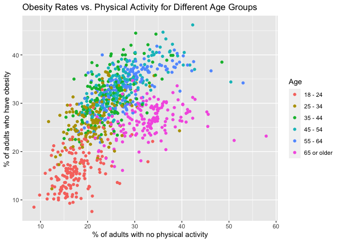
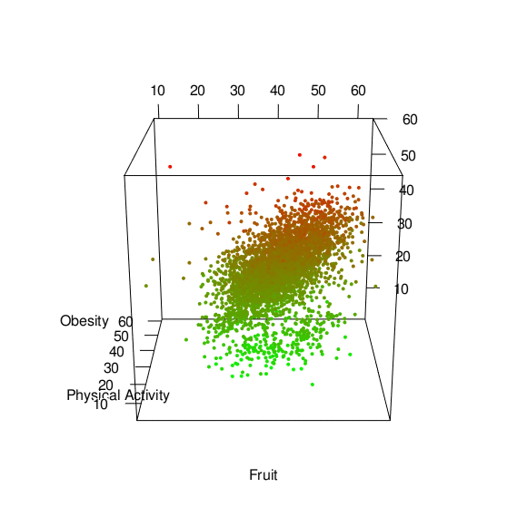
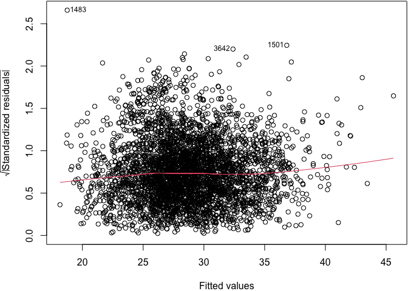

Analysis of CDC Dataset
================
Kirill Gavrilov, Kaiyan Li, Victor Wang
04/12/2020

# Abstract

The prevalence of obesity has increased in the United States in the past
\(decades^1\). A wide range of medical complications of obesity, such as
diabetes, hypertension, heart disease, respiratory disease,
significantly reduced patients’ quality of \(life^2\). This statistical
analysis provides time trends for adults over 18 years old are
classified to have obesity (body mass index (BMI) \> 30) from 2011-2016,
using data from Center for Disease Control and Prevention (CDC).
Moreover, the data is inspected with respect to the food intake and
physical activity levels.

# Introduction

Over the last three decades, mean body mass index (BMI; kg/m2) has
increased by 0.4 kg/m2 per \(decade^3\). The United States has the
highest mean BMI among high-income countries, leading to one in four
adults having a BMI \> 30 kg/m2 based on self-reported height and
\(weight^4\). This study analyses data from the Center for Disease
Control and Prevention (CDC) collected over 6 years from 2011-2016 in
all states of America. Each data point represents a proportion of people
that fall under a particular demographic. Individuals are classified
into age, income, gender, education and ethnic categories. Aside from
obesity rates, the data also includes proportions of people with
specific food intake habits, as well as various physical activity
levels. Our goal is to determine the existence of a relationship between
obesity rates and lifestyle choices of patients. We will be inspecting
how obesity rates may relate to percent of people that consume fruits
and vegetables less than one time per day and do not engage in leisure
time physical activity. Additional analysis will be performed to confirm
the increasing levels of obesity in the United States and precisely
identify a state with significant evidence.

# Data Description

Center for Disease Control (CDC) collected data from distinct
demographic groups throughout 2011 to 2016 in all states of America.
Demographic groups include: age, income, education level, ethnicity and
gender. Each group was sampled for 9 different categories:

  - Percent of adults aged 18 years and older who have obesity
  - Percent of adults aged 18 years and older who have an overweight
    classification
  - Percent of adults who report consuming fruit less than one time
    daily
  - Percent of adults who report consuming vegetables less than one time
    daily
  - Percent of adults who engage in muscle-strengthening activities on 2
    or more days a week
  - Percent of adults who achieve at least 150 minutes a week of
    moderate-intensity aerobic physical activity or 75 minutes a week of
    vigorous-intensity aerobic activity (or an equivalent combination)
  - Percent of adults who achieve at least 150 minutes a week of
    moderate-intensity aerobic physical activity or 75 minutes a week of
    vigorous-intensity aerobic physical activity and engage in
    muscle-strengthening activities on 2 or more days a week
  - Percent of adults who achieve at least 300 minutes a week of
    moderate-intensity aerobic physical activity or 150 minutes a week
    of vigorous-intensity aerobic activity (or an equivalent
    combination)
  - Percent of adults who engage in no leisure-time physical activity

In this study we would like to answer the following questions:

1.  Is there relationship between *obesity rates* and *fruit/vegetable
    intake alongside physical activity*?
2.  Is there significant evidence that *obesity rates* in the USA are
    growing? If so, for which states?

To get a sense of what to anticipate for the upcoming analysis, we will
plot classifications of interest versus obesity rates. Age category is
crucial to investigate, therefore we will start by plotting this obesity
rates versus physical activity for each age demographic.

</img>

Figure 1

There’s a fairly evident pattern seen form the plot, however needs
further analysis on the strength.

Now plotting the same graph but for different ethnic demographic.

</img>

Figure 2

This plot does not give us much insight on a relationship between
obesity levels and physical activity, however after conducting analysis
we may deduce some type of pattern.

Moving on to another to investigate connection between obesity % and
fruit intake again, classified by age.

</img>

Figure 3

An apparent linear pattern is present between all age groups. Further
analysis necessary to determine the strength.

Plotting the same graph but for different ethnic demographic.

</img>

Figure 4

Once again, racial classification does not seem to give us any type of
insight.

To help us further visualize mandatory data, a 3D plot of obesity
percentages, fruit consumption and physical activity levels were
plotted.

</img>

Figure 5

-----

To answer the second question, visualization of obesity rates per year
is the most appropriate way to understand what data we are dealing with.

</img>

Figure 6

It is not evident which states are showing a positive relationship and
whether or not it is strong.

# Methods

This analysis was completed using statistical software RStudio. Package
“tidyverse” was used for visualization and dataframe manipulation.
Package “faraway” provided function for calculation of variance
inflation factor, which was used to assess multicollinearity. Robust
regression model was built using “MASS” package. 3D plot was created
using “plot3D” package, rendered with “rgl” and converted into gif
format with “magick” package. An ordinary least squares regression
model, analysis of variance and other basic function were performed with
pre-loaded default packages like “base” and “stats”. Documentation of
the analysis was written in R environment using Markdown language.

# Results

Firstly we need to analyze the original dataset, remove all the
unnecessary variables and observations, add a new point to the dataset
to make it unique. Since we are mainly going to be working with the
obesity percentage data points, we will fill in the missing value for
obesity % in Alabama in 2011, specifically for “Other” ethnicity.
Particular value was chosen by looking at near by states at that year
for that demographic.

``` r
library(tidyverse)
library(faraway)
cdc = read.csv("Nutrition__Physical_Activity__and_Obesity_-_Behavioral_Risk_Factor_Surveillance_System.csv")

# Removing LocationAbbr, and renaming LocationDesc, DataSource, Topic, TopicID,
# ClassID, GeoLocation, Data_Value_Unit, Data_Value_Type, DataValueTypeID,
# Data_Value_Footnote_Symbol, StratificationCategoryId1, StratificationID1
cdc_adjusted = cdc %>% select(-YearEnd, -LocationAbbr, -Datasource, -Topic, -TopicID, 
    -ClassID, -GeoLocation, -Data_Value_Unit, -Data_Value_Type, -DataValueTypeID, 
    -Data_Value_Footnote_Symbol, -StratificationCategoryId1, -StratificationID1, 
    -Data_Value_Alt, -Data_Value_Footnote, -Low_Confidence_Limit, -High_Confidence_Limit) %>% 
    rename(Year = YearStart, Location = LocationDesc)

# Removing Virigin Islands because they have observations for only 2016
cdc_adjusted = cdc_adjusted[!(cdc_adjusted$Location == "Virgin Islands"), ]
cdc_adjusted[28, 5] = 30.2
cdc_adjusted[28, 6] = 64
```

Other tedious dataframe transformations were omitted from the report and
further information is available in the appendix.

We now want to analyze the ordinary least squares model that relates
obesity rates to people who report eating fruit and vegetable less than
1 time a day and engage in no physical activity.
\(obesity =\beta_0 + \beta_1fruit + \beta_2vegetable + \beta_3exercise\)

``` r
model <- lm(Data_Value36 ~ Data_Value18 + Data_Value19 + Data_Value47, data = total)
summary(model)
```

    ## 
    ## Call:
    ## lm(formula = Data_Value36 ~ Data_Value18 + Data_Value19 + Data_Value47, 
    ##     data = total)
    ## 
    ## Residuals:
    ##     Min      1Q  Median      3Q     Max 
    ## -28.772  -2.566   0.511   3.319  40.673 
    ## 
    ## Coefficients:
    ##               Estimate Std. Error t value Pr(>|t|)    
    ## (Intercept)  10.692237   0.541529  19.745   <2e-16 ***
    ## Data_Value18  0.201578   0.017340  11.625   <2e-16 ***
    ## Data_Value19 -0.009529   0.019091  -0.499    0.618    
    ## Data_Value47  0.378433   0.014444  26.201   <2e-16 ***
    ## ---
    ## Signif. codes:  0 '***' 0.001 '**' 0.01 '*' 0.05 '.' 0.1 ' ' 1
    ## 
    ## Residual standard error: 5.728 on 3984 degrees of freedom
    ## Multiple R-squared:  0.2975, Adjusted R-squared:  0.297 
    ## F-statistic: 562.5 on 3 and 3984 DF,  p-value: < 2.2e-16

Individual p-values are showing significant evidence towards being
important except for percent of people who consume vegetables less than
once daily (Data\_Value19). Backwards elimination technique is
applicable in this case to reduce the model and hopefully increase the
R-squared.

``` r
# Using Backward Elimination method, remove the variable Data_Value19
model <- lm(Data_Value36 ~ Data_Value18 + Data_Value47, data = total)
summary(model)
```

    ## 
    ## Call:
    ## lm(formula = Data_Value36 ~ Data_Value18 + Data_Value47, data = total)
    ## 
    ## Residuals:
    ##     Min      1Q  Median      3Q     Max 
    ## -28.819  -2.566   0.531   3.313  40.451 
    ## 
    ## Coefficients:
    ##              Estimate Std. Error t value Pr(>|t|)    
    ## (Intercept)  10.72451    0.53760   19.95   <2e-16 ***
    ## Data_Value18  0.19699    0.01470   13.40   <2e-16 ***
    ## Data_Value47  0.37565    0.01333   28.19   <2e-16 ***
    ## ---
    ## Signif. codes:  0 '***' 0.001 '**' 0.01 '*' 0.05 '.' 0.1 ' ' 1
    ## 
    ## Residual standard error: 5.727 on 3985 degrees of freedom
    ## Multiple R-squared:  0.2975, Adjusted R-squared:  0.2971 
    ## F-statistic: 843.8 on 2 and 3985 DF,  p-value: < 2.2e-16

All variables still remain significant in the model and R-squared is a
bit higher as well. Updated linear regression model now becomes:
\[obesity =\beta_0 + \beta_1fruit + \beta_2vegetable\]. Following,
variance inflation factor is calculated to ensure multicollinearity is
not present in the equation.

``` r
vif(model)
```

    ## Data_Value18 Data_Value47 
    ##     1.273901     1.273901

Since both values are notably below 10, we can safely say that
multicollinearity is not an issue.

Crucial part of model validation is residual assessment. Residuals for
particular model are:



As seen from the plots above, residuals are uncorrelated and the
constant variance assumption is satisfied, although residuals do tend to
deviate from the straight line in the Normal Q-Q plot. Since there is no
apparent pattern in the residuals, data transformation is not relevant.
Fitting a robust linear regression model is a more applicable solution
in this case with Huber’s t robust criterion function.

``` r
library(MASS)
model_robust = rlm(Data_Value36 ~ Data_Value18 + Data_Value47, data = total)
summary(model_robust)$coefficient
```

    ##                   Value Std. Error  t value
    ## (Intercept)  10.8018580 0.44410037 24.32301
    ## Data_Value18  0.2363781 0.01213918 19.47234
    ## Data_Value47  0.3281886 0.01100872 29.81171

The resulting coefficient values are highly similar to those in the
ordinary least squares regression model. Therefore, we will continue our
analysis with the OLS equation.

Cross validation was carried out to further assess the performance of
the model. Even though the R-squared value of the current model is
0.2975, mean prediction error turned out to be 20.86% for the percent of
adults who have obesity.

Further altering current regression model
\(obesity =\beta_0 + \beta_1fruit + \beta_2exercise\) to be sensetive to
a particular demographic, such as age, ethnicity, gender, income or
education. The equation now becomes: $ obesity =\_0 + \_1fruit +
\_2exercise + \_iIndicator\_i$

Results of the first instance where the indicator variable is Age:

    ## 
    ## Call:
    ## lm(formula = Data_Value36 ~ Data_Value18 + Data_Value47 + Age, 
    ##     data = total)
    ## 
    ## Residuals:
    ##     Min      1Q  Median      3Q     Max 
    ## -29.399  -2.248   0.264   2.594  41.094 
    ## 
    ## Coefficients:
    ##                 Estimate Std. Error t value Pr(>|t|)    
    ## (Intercept)      9.81005    0.49760  19.715  < 2e-16 ***
    ## Data_Value18     0.30070    0.01531  19.637  < 2e-16 ***
    ## Data_Value47     0.25716    0.01400  18.363  < 2e-16 ***
    ## Age18 - 24     -11.90797    0.46225 -25.761  < 2e-16 ***
    ## Age25 - 34      -0.91786    0.42539  -2.158  0.03101 *  
    ## Age35 - 44       3.29889    0.41855   7.882 4.14e-15 ***
    ## Age45 - 54       4.22800    0.41625  10.157  < 2e-16 ***
    ## Age55 - 64       4.54163    0.41927  10.832  < 2e-16 ***
    ## Age65 or older  -1.29409    0.45873  -2.821  0.00481 ** 
    ## ---
    ## Signif. codes:  0 '***' 0.001 '**' 0.01 '*' 0.05 '.' 0.1 ' ' 1
    ## 
    ## Residual standard error: 5.094 on 3979 degrees of freedom
    ## Multiple R-squared:  0.4451, Adjusted R-squared:  0.444 
    ## F-statistic: 398.9 on 8 and 3979 DF,  p-value: < 2.2e-16

Summary of this model shows every age group to be significant. Relating
back to Figure 1 in the data description section, particular model
solidifies our findings.

Applying the same concept but now indicator variable will be ethnicity.

    ##                                                  Pr(>|t|)
    ## (Intercept)                                 8.068263e-159
    ## Data_Value18                                 6.440225e-36
    ## Data_Value47                                2.083723e-181
    ## Race.Ethnicity2 or more races                1.720172e-09
    ## Race.EthnicityAmerican Indian/Alaska Native  3.366855e-26
    ## Race.EthnicityAsian                         1.577046e-225
    ## Race.EthnicityHawaiian/Pacific Islander      7.941426e-09
    ## Race.EthnicityHispanic                       4.767428e-01
    ## Race.EthnicityNon-Hispanic Black             6.957030e-49
    ## Race.EthnicityNon-Hispanic White             1.097539e-01
    ## Race.EthnicityOther                          7.135951e-03

Even though the related Figure 2, does not suggest strong visual
evidence that different racial demographics have strong linear
correlation, the hypothesis test indicates otherwise for most variables.
Most likely that is due to addition of the fruit consumption variable in
the model, where the graph does not include it.

Repeating the same procedure for other demographics to find that gender,
income and education do not have strong evidence of a relationship
between other variables.

## Analysis of total obesity rates for every state

Analyzing the ordinary least squares model of how obesity rates relate
to the year in order to conclude growing obesity rate in the country.
Specifically, we will look at the “Total” category which represents the
final obesity percentage for each state in a particular year.

\[ obesity =\beta_0 + \beta_1year + \epsilon\]

    ## 
    ## Call:
    ## lm(formula = Data_Value36 ~ Year, data = Q36)
    ## 
    ## Residuals:
    ##     Min      1Q  Median      3Q     Max 
    ## -9.2098 -2.4132  0.0902  2.1668  7.8435 
    ## 
    ## Coefficients:
    ##              Estimate Std. Error t value Pr(>|t|)    
    ## (Intercept) -870.6594   224.9770  -3.870 0.000132 ***
    ## Year           0.4467     0.1117   3.998 7.96e-05 ***
    ## ---
    ## Signif. codes:  0 '***' 0.001 '**' 0.01 '*' 0.05 '.' 0.1 ' ' 1
    ## 
    ## Residual standard error: 3.403 on 317 degrees of freedom
    ## Multiple R-squared:  0.048,  Adjusted R-squared:  0.04499 
    ## F-statistic: 15.98 on 1 and 317 DF,  p-value: 7.959e-05

P-value for the model does seem to indicated that there’s evidence of
significant relationship between obesity rates and year, however the
R-squared is extremely low. Let’s take a look at the residuals.

``` r
par(mar = c(4, 4, 0.1, 0.1))
plot(model_all_states, which = c(2, 2))
plot(model_all_states, which = c(4, 4))
```


Standardized residuals do not look out of place for the most part. There
are a couple of observations that fall out of the straight normality
line like \#307 and \#35, however that is expected. Out of 319
observations, 1% of those are expected to be potential outliers
according Normal Distribution. Taking a look at the Cook’s distance to
inspect any influential points, we find that gladly there aren’t any.
Observation \#307 appears again with the largest Cook’s distance of just
about 0.025. In order for the point to be considered influential, it’s
Cook’s distance should be greater than 1.

Let’s reduce our set of observations to only the states that show
significant evidence of increase obesity rates. Visualizing will also
help us draw any conclusions.

<!-- --> Particular image represents
total obesity rates graph of observations for all states. Lines in grey
colour are the states that do not show significant increase in obesity
rates in 6 years. That was deducted by building an individual linear
model for each state versus year. If the p-value was greater than 0.05,
that state is considered to not have increasing obesity rates. In
contrary, coloured lines indicate growing obesity rates. Further more,
red and black lines show the full model slope for both, all states and
states with growing obesity rates respectively.

We can investigate this further by looking more closely at the
observations. States that have relatively low obesity rates in 2011,
tend to maintain that trend and hold obesity rates constant. On the
other hand, states with higher obesity rates initially, show evidence of
increasing rates.

``` r
model_updated = lm(Data_Value36 ~ Year, data = Q36_reduced)
summary(model_updated)
```

    ## 
    ## Call:
    ## lm(formula = Data_Value36 ~ Year, data = Q36_reduced)
    ## 
    ## Residuals:
    ##     Min      1Q  Median      3Q     Max 
    ## -5.8156 -1.5451 -0.3539  1.5240  5.9549 
    ## 
    ## Coefficients:
    ##               Estimate Std. Error t value Pr(>|t|)    
    ## (Intercept) -1213.0936   251.0881  -4.831 3.65e-06 ***
    ## Year            0.6176     0.1247   4.953 2.16e-06 ***
    ## ---
    ## Signif. codes:  0 '***' 0.001 '**' 0.01 '*' 0.05 '.' 0.1 ' ' 1
    ## 
    ## Residual standard error: 2.475 on 134 degrees of freedom
    ## Multiple R-squared:  0.1547, Adjusted R-squared:  0.1484 
    ## F-statistic: 24.53 on 1 and 134 DF,  p-value: 2.164e-06

``` r
par(mar = c(4, 4, 0.1, 0.1))
plot(model_updated, which = c(2, 2))
plot(model_updated, which = c(4, 4))
```


Taking a look at the updated model for obesity rates over the years,
there’s a substantial increase in the value of intercept coefficient and
slope remains relatively the same. Residuals appear to be in good shape
with slight deviation from the Normal line and do not violate the
independence assumption.

3D plot
